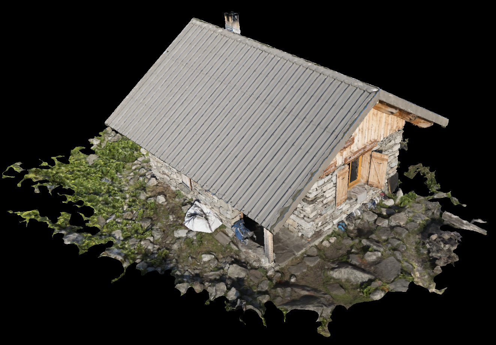
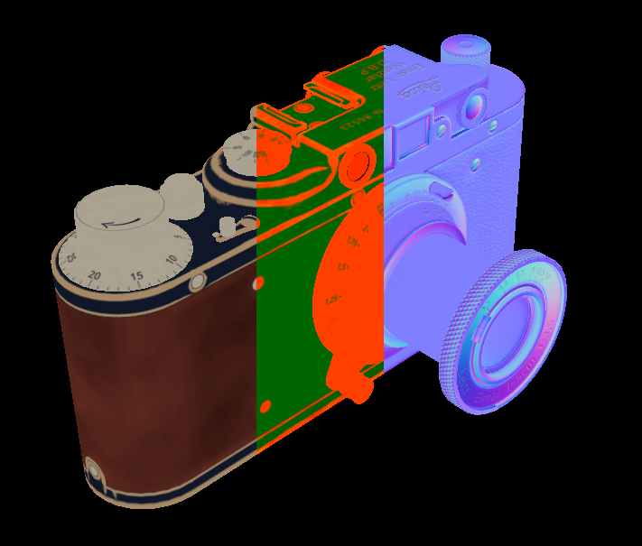
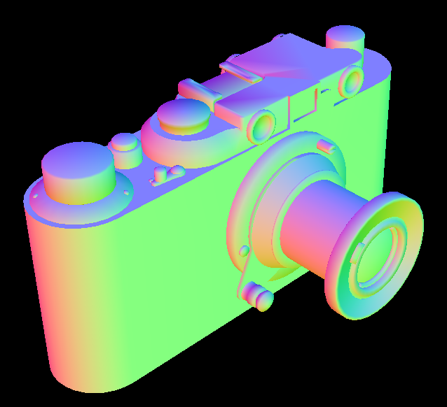
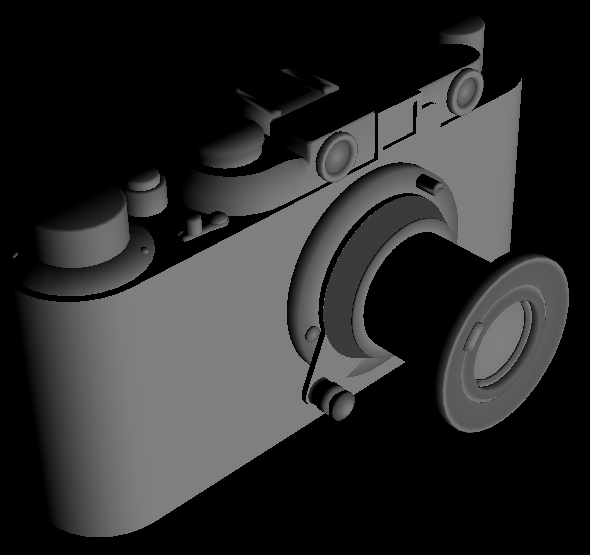
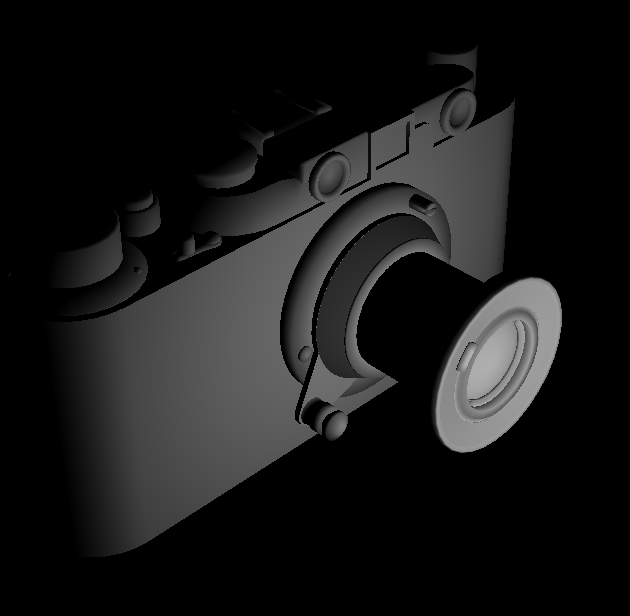
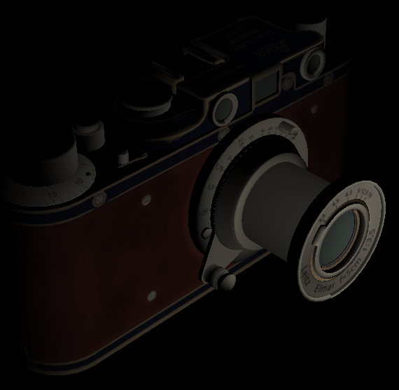
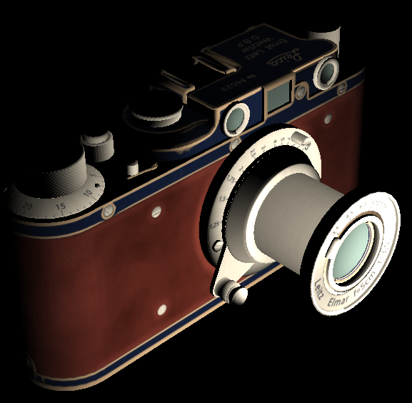
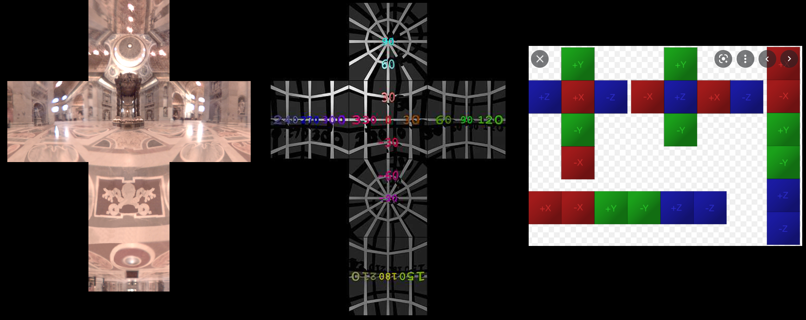
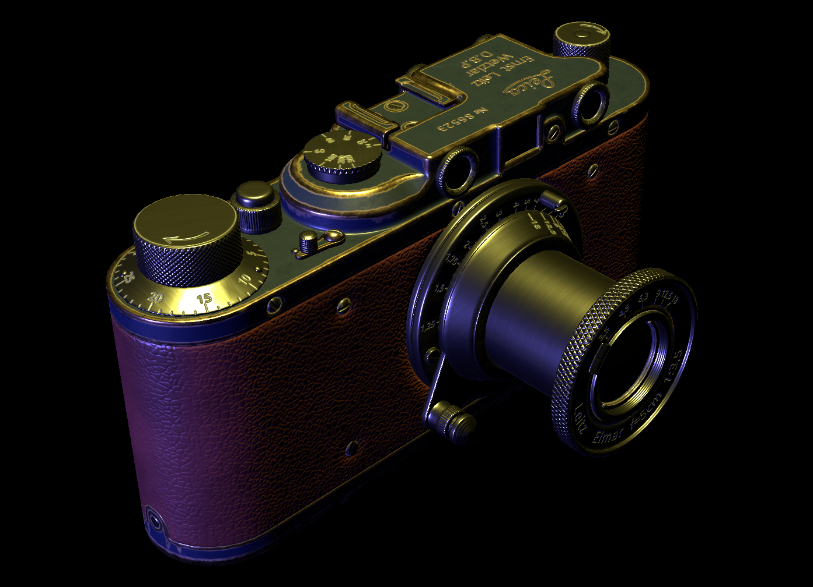

# Step 1

The first step was to follow the following Vulkan tutorial to draw a flat-shaded model.

https://vulkan-tutorial.com/Introduction



.\
.\
.\
.\
.\
.

# Step 2

The second step was to load albedo, normal and metal-roughness map and stuff them into a texture array.

http://kylehalladay.com/blog/tutorial/vulkan/2018/01/28/Textue-Arrays-Vulkan.html



## Change the fragment shader to address the three textures as a single array.
```
#version 450
#extension GL_ARB_separate_shader_objects : enable

layout(set = 0, binding = 1) uniform sampler2D textures[ 3 ];

layout(location = 0) in vec3 fragColor;
layout(location = 1) in vec2 fragTexCoord;

layout(location = 0) out vec4 outColor;

void main() {
    outColor = vec4( texture( textures[ 0 ], fragTexCoord ).rgb, 1.0 );
}
```

.\
.\
.\
.\
.\
.

# Step 3

The next step was to add vertex normals in world-space.



## Our updated Vertex struct looks like this:
```
struct Vertex {
	glm::vec3 pos;
	glm::vec3 color;
	glm::vec2 texCoord;
	glm::vec3 normal;

    ...

	static std::array< VkVertexInputAttributeDescription, 4 > getAttributeDescriptions() {
		std::array< VkVertexInputAttributeDescription, 4> attributeDescriptions = {};

        ...

		attributeDescriptions[3].binding = 0;
		attributeDescriptions[3].location = 3;
		attributeDescriptions[3].format = VK_FORMAT_R32G32B32_SFLOAT;
		attributeDescriptions[3].offset = offsetof(Vertex, normal);

		return attributeDescriptions;
	}

	bool operator==( const Vertex & other ) const {
		return pos == other.pos && color == other.color && texCoord == other.texCoord && normal == other.normal;
	}
};
```

## Add the following to ShowModel()
```
    ...
    vertex.normal = {
        attrib.normals[ 3 * index.normal_index + 0 ],
        attrib.normals[ 3 * index.normal_index + 1 ],
        attrib.normals[ 3 * index.normal_index + 2 ]
    };
    ...
```

## The vertex shader transforms the normal into world-space and divides by the homogenous coordinate.
```
...
layout(location = 0) in vec3 inPosition;
layout(location = 1) in vec3 inColor;
layout(location = 2) in vec2 inTexCoord;
layout(location = 3) in vec3 inNormal;

layout(location = 0) out vec3 fragColor;
layout(location = 1) out vec2 fragTexCoord;=
layout(location = 2) out vec3 fragNormal;

out gl_PerVertex {
    vec4 gl_Position;
};

void main() {
    gl_Position = ubo.proj * ubo.view * ubo.model * vec4(inPosition, 1.0);
    fragColor = inColor;
	fragTexCoord = inTexCoord;

    vec4 n = ubo.model * vec4( inNormal, 1.0f );
    fragNormal = n.xyz / n.w;
}
```

## Finally, the fragment shader displays the vertex normal that has been scaled to the positive 0-1 range.
```
...
layout(location = 0) in vec3 fragColor;
layout(location = 1) in vec2 fragTexCoord;
layout(location = 2) in vec3 fragNormal;

layout(location = 0) out vec4 outColor;

void main() {
	outColor.xyz = fragNormal.xyz * 0.5f + 0.5f;
	outColor.w = 1.0f;
}
```

.\
.\
.\
.\
.\
.

# Step 4 - Add the light buffer


The light buffer is a buffer of type VK_DESCRIPTOR_TYPE_STORAGE_BUFFER that stores all the lights and their properties.

On the fragment side, it looks like the following.
```
layout(binding = 2) buffer Light {
	vec3 worldOrigin;
	float radius;
} lights;
```

We output the dot product of the normalized light vector with the normalized vertex normal, which gives us the cosine of the angle of incidence.

```
	...
	vec3 lightVec = normalize( lights.worldOrigin - fragWorldPosition );
	float dp = max( dot( fragNormal, lightVec ), 0.0 );
	outColor.xyz = vec3( dp, dp, dp );
	...
```

.\
.\
.\
.\
.\
.

# Step 5 - Add light attenuation

Linear attenuation fades the light as a fraction of the radius. Not physically accurate as well as changing brightness as the radius of the light changes.

```
	dp *= 1.0 - clamp( length( lights.worldOrigin - fragWorldPosition ) / lights.radius, 0.0, 1.0 );
```



Next we try inverse square falloff attenuation used in Unreal Engine.

```
	float distance = length( lights.worldOrigin - fragWorldPosition );
	float a = distance / lights.radius;
	float b = clamp( 1.0 - a * a * a * a, 0.0, 1.0 );
	float falloff = ( b * b ) / ( distance * distance + 1.0 );
	dp *= falloff;
```

\

.\
.\
.\
.\
.\
.

# Step 6 - Add per-pixel normals


- Merged in mikktspace.c from [mikktspace](http://www.mikktspace.com/)
- Combined mikktspace with tiny_obj_loader

Added the following to the vertex shader
```
    vec4 t = ubo.model * vec4( inTangent, 1.0f );
    t.xyz /= t.w;
    fragTangent = vec4( t.x, t.y, t.z, inBitangentSign );
```

Added the following to the fragment shader
```
	vec3 vNt = vec4( texture( textures[ 2 ], fragTexCoord ).rgb, 1.0 ).xyz;
	vec3 vN = fragNormal;
	vec3 vT = fragTangent.xyz;
	vec3 vB = fragTangent.w * cross(vN, vT);
	vec3 vNout = normalize( vNt.x * vT + vNt.y * vB + vNt.z * vN );
```

### Combining the normals + diffuse gives us the following:



.\
.\
.\
.\
.\
.

# Step 7 - Add brightness to lights

Added a single float brightness to the light structure in the fragment shader and the cpp code.
```
layout(binding = 2) buffer Light {
	vec3 worldOrigin;
	float radius;
	float brightness;
} lights;
```



The value here is 4.0 lumens.

## Then added a light color like so:
```
layout(binding = 2) buffer Light {
	vec3 worldOrigin;
	float radius;
	vec3 color;
	float brightness;
} lights;
```

The final color is calculated like so:
```
	outColor.xyz = vec3( dp, dp, dp ) * baseColor.xyz * lights.brightness * lights.color;
```

Here is a yellow light of (1.0, 1.0, 0.5) with a brightness of 4.0 lumens.


.\
.\
.\
.\
.\
.

# Step 8 - Handle sRGB to lRGB conversion

We need to convert the base color texture from sRGB to lRGB and the calculated light value from lRGB back to sRGB for storage in the framebuffer (since our framebuffer is VK_COLOR_SPACE_SRGB_NONLINEAR_KHR).

I'm using the color space conversions from [ColorSpaces.inc.glsl](https://github.com/tobspr/GLSL-Color-Spaces/blob/master/ColorSpaces.inc.glsl)

I switched the shader compiler from glslangValidator.exe to Google's glslc.exe that ships with the Vulkan SDK. This allows you to #include a file in the shaders.

The new SPIR-V compile batch file is:
```
glslc.ex shader.vert -o vert.spv
glslc.exe shader.frag -o frag.spv
```

Added the following to the top of shader.frag
```
#include "ColorSpaces.inc.glsl"
```

The basecolor lookup now converts from sRGB to lRGB.
```
vec4 baseColor = vec4( srgb_to_rgb( texture( textures[ 0 ], fragTexCoord ).rgb ), 1.0 );
```

The light color is converted from sRGB to lRGB. And finally the computed light value converts back from lRGB to sRGB for storage in the sRGB unnormalized framebuffer.
```
outColor.xyz = rgb_to_srgb( vec3( dp, dp, dp ) * baseColor.xyz * lights.brightness * srgb_to_rgb( lights.color ) );
```


.\
.\
.\
.\
.\
.

# Step 9 - Various Fixes to match Blender


- You have to set Blender to measure the camera FOV in angles. It measures it in the horiztonal direction and glm expects the vertical FOV. Needed to multiple our FOV by the vertical / height aspect ratio to convert between the two.

- Proper conversion from Blender's Watts light power output to Lumens. 1 Watt = 683 lumens. So we set the watts in blender then multiply by 1 / 683. Finally, we need to divide by a 1000 to get lumens (Not sure why, but probably just so the Watts measurement is in whole numbers in blender ).

- Changed the width/height of camera to 1920/1080 since that's the default in Blender.

- The normals read from texture are in [0,1] range and centered around 0.5. We need [-1,1] so multiply them by 2 and subtract 1.

- Convert BaseColor from sRGB to linear texture color space.

- Clamp the roughness to [0.045,1] range and linear texture color space.

- Set the reflectance F0 value to 0.5.

- Use the metallic value directly with no modification and linear texture color space.

.\
.\
.\
.\
.\
.

# Step 10 - Loading EXR files into HDR textures

Planning Notes
- Need to load HDR images somehow so we can process them into light probes.
- Decided on loading Panographic sky images instead of Horizontal-Cross images as panos are more used by artists and art packages.
- Decided on EXR format as it is easy to read and write it using tinyexr library. While it is easy to load HDR pngs, it is not so easy to write them back out.
- Using zlib compression for EXR format.

Implementation Notes
- Had to hand off sRGB conversion to texture unit so we could have a mix of linear and sRGB images.

Below is the same texture loaded as EXR and TGA. Top row is EXR to a linear R32G32B32A32 texture and bottom row is 8-bit TGA to a R8G8B8A8 SRGB texture.


.\
.\
.\
.\
.\
.

# Step 11 - Environment Mapping using HDR Cubemap

Planning Notes
- Needed a way to store all mips of a cubemap on disk. Decided to store them as EXR format with each mip and side split out from the others. This will make debugging the light-probe generated cubemaps easier.

Implementation Notes
- Vulkan expects cubemaps to be stored in an indexed array with sides: front, back, up, down, right and finally left. Note that these images are stored in their natural orientation which, for the -Y and -X images is flipped 180 degreed compared to the vertical cross format.
- Each face is stored as a seperate EXR and is post-fixed with _nx for negative-x and _pz for positive-z, etc.

Below is the HDR environment map used from Paul Debevec's website, along with it being applied to a sphere and the test model.


Below is the HDR environment map along with a test image showing the orientation as well as a graphic showing the vertical cross layout orientation in world-space. Note the -Y and -X faces are upside down in the vertical cross format. These two had to be flipped 180 degrees to be stored properly in the flat EXR format.


.\
.\
.\
.\
.\
.

# Step 12 - Multiple Lights and Refactor

Added multiple light support and refactored a bunch of stuff.



.\
.\
.\
.\
.\
.

# Step 13 - Adding Background

- Added a background image derived from a pano map.


- This is the pano that was used (from Blender).


.\
.\
.\
.\
.\
.

# Step 14 - IBL Generation Steps

At runtime we will draw the model using the lights while also adding in the new ambient term, which will consist of the diffuse part of the IBL and the specular part added together. The diffuse contribution will be stored in a cubemap as the infalling radiation (irradiance) from the environment map and is calculated through convolution which is a blurring process to remove any high frequency detail.

So what do we need to calculate this? We need to draw six views, where each view's frustum is aligned to a direction the world axis representing a face of the cubemap. We draw a sphere with the pano map mapped onto it. However, in the shader, instead of just outputting the pixels directly, we'll compute the convolution.
